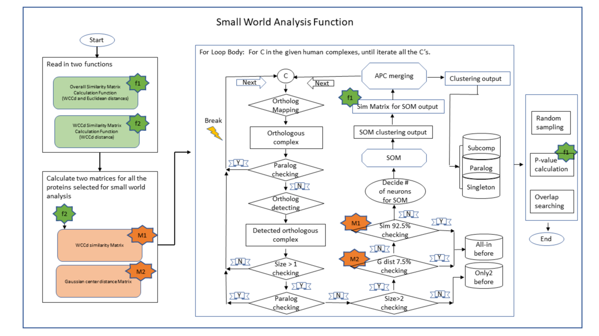

# R-code-S4_Class-protein-clustering-based-on-data-integration-of-corum-and-inparanoid

A machine learning-based approach to identify reliable gold standards for protein complex composition prediction.



The program diagram above is an illustration of the small world analysis. The "Sim 92.5%" and "G dist 7.5%" are 95% and 5% which were used in the project.

---

## Introduction
The project addresses a fundamental issue of using CORUM complexes as reference knowledge in evaluation of protein complex predictions. In plant cell extracts, co-fraction mass spectrometry (CFMS) data and some published literature indicated that fully assembled CORUM complexes rarely exist. Using inaccurate gold standards would result in a wrong validation dataset, misleading prediction models to unreliable predictions. To overcome this issue, we have developed machine learning approaches to identify a refined set of gold standards by integrating the information of CORUM and CFMS.

 
## Install

1. First recommend to have R >= 4.2.0 

```
$ install.packages("apcluster")
$ install.packages("kohonen")
```
2. once installation of ‘kohonen’ completed, find path in your computer:
     path...\R\win-library\R version...\kohonen\Distances
3. copy and paste the file “wcc3.cpp” into “Distances” folder found in step 2.
4. Set the path in row in the following R code and copy and paste "S4 data integration corum inparanoid clustering.R" and the input data for rice clustering in the folder under the path that just created.

Here is a list of dependent packages:

```
1. library(tempR)
2. library(methods)
3. library(MASS)
4. library(dplyr)
5. library(ggplot2)
6. library(ggrepel)
7. library(openxlsx)
8. library(tibble)
9. library(tidyverse)
10. library(kohonen) # self organizing map
11. library(apcluster) # affinity propagation
```

---

## Run
Here the R commands that you need to run:
```
rm(list = ls()) 
library(kohonen)  
library(apcluster) 
library(tempR)
library(methods)
library(MASS)
library(dplyr)
library(ggplot2)
library(ggrepel)
library(openxlsx)
library(tibble)
library(tidyverse)
require(Rcpp) # help to integrate R and C++ via R functions
sourceCpp(system.file("Distances", "wcc3.cpp", package = "kohonen",  mustWork = TRUE)) # expose C++ function wcc3 to R level

getwd()
workingDir = "create your path"
setwd(workingDir)
source("S4 data integration corum inparanoid clustering.R")
options(stringsAsFactors = FALSE)

Protein.Complexes.Gold.Standard.Prediction.Rice <- new("Protein.Complexes.Gold.Standard.Prediction",
                                                       mammalPlantSpecies=c("human", "rice"),
                                                       mammalCORUM.Data=get(load(file="Data_CORUM_human.RData")),
                                                       mammalPlantOrtholog.Data=read.table("SQLtable.Human.fasta-Rice.FA", header = T),
                                                       mammalCORUM.StoichiometryData=get(load(file="CORUM_human_stoichiometry.RData")),
                                                       plantProtnames.Data=get(load(file="rice_protnames_data.RData")),
                                                       plantMmono.Data=get(load(file="rice_mmono_data.RData")),
                                                       peakProfileMatrixB1=get(load("Matrix_SEC_rice_1.RData")),
                                                       peakProfileMatrixB2=get(load("Matrix_SEC_rice_2.RData")),
                                                       reproduciblePeakFeatures.Data=get(load(file="Rice_Reproducible_SEC_data_plant.RData")),
                                                       singlePeakProts=get(load(file="Rice_prots_reproducible_single_peak.RData")),
                                                       multiplePeakProts=get(load(file="Rice_protsreproducible_multiple_peak.RData")),
                                                       mostCommonProtIDExample="LOC_Os03g51600.1",
                                                       genomeCoverageCutoff=0.66666,
                                                       RappCutoffNonmono = 1.6,
                                                       RappCutoffChoosingThreshold=1,
                                                       parametersSOM=list(num_of_multiple_of_sample_size=500, topo_shape="rectangular", toroidal_choice=F,  
                                                                          user_weight=c(0.35, 0.35, 0.15, 0.15), 
                                                                          dist_measure=c("WCCd3","WCCd3", "euclidean", "euclidean")),
                                                       parametersAPC=list(q_1=0.95,q_2=0.85,q_3=0.8,maxits=50000, convits=10000, lam=0.9,detail=F),
                                                       crossCorrelationRadius=3,
                                                       exogenousClusteringResult=get(load(file="Clustering_resultRice.RData")),
                                                       targetCluster="X1000")

clustering_rice <- ProteinComplexGoldStandardPredictionWithinCORUMOrthologousComplexes(Protein.Complexes.Gold.Standard.Prediction.Rice)
```


---

## Hyperparameter Tuning

For the two-step clustering analysis, we determined three parameters of the clustering algorithms,including the weight w on "WCCd", the number of clusters in SOM, and the merging threshold for the AP algorithm.
As SOM and AP are unsupervised learning, the process of training this model involves choosing the optimal hyperparameters such that the clustering algorithm will correctly label proteins in orthocomplexes where the memberships of the subunits are known. The two-stage model transferred knowledge between the five supervised clustering tasks by tuning the hyperparameters until all the 4 (sub)complexes have been clustered in consistent with the true memberships. Let $\theta_i^*$ denote the hyperparameter tuned from model training on the data set containing known subcomplex, where i=19S, 20S, 14-3-3RAF, 14-3-3HAF, Exosome.


 
1. (<b>`The combination weight`</b>) : the combination weight of "WCCd3" and "euclidean". After training, the weight of 0.35 were assigned to "WCCd3" and 0.15 to "euclidean".

2. (<b>`The number of clusters in SOM`</b>) or (<b>`the structure of neurons of SOM`</b>): After training, the relationship between the number of proteins in the orthocomplex are defined as follows:
   
```
   # num_p is the number of proteins in the orthocomplex
   # x_limit is the number of columns of the 2-d grid in SOM, and y_limit the number of rows.
   num_p <- length(prot_id_rep_c)
    
    if (num_p<6){
      x_limit <- 1
      y_limit <- num_p
    }
    
    if (num_p>=6 & num_p<10){
      x_limit <- 2
      y_limit <- 3
    }
    
    if (num_p>=10 & num_p<15){
      x_limit <- 3
      y_limit <- 3
    }
    
    if (num_p>=15 & num_p<20){
      x_limit <- 3
      y_limit <- 4
    }
    if (num_p>=20 & num_p<35){
      x_limit <- 4
      y_limit <- 4
    }
    
    if (num_p>=35 & num_p<60){
      x_limit <- 4
      y_limit <- 5
    }
    if (num_p>=60 & num_p<80){
      x_limit <- 5
      y_limit <- 5
    }
    
    if (num_p>=80 & num_p<100){
      x_limit <- 5
      y_limit <- 6
    }
    if (num_p>=100){
      x_limit <- 5
      y_limit <- 10
    }
```

3.  (<b>`The merging threshold for the AP algorithm`</b>) or (<b>`input preference in AP`</b>): After training, the input preference was defined according to the number of the orthocomplex as below: 
   if # of prots < 4, then the preference, q_1=0.95; else if 3 < # of prots < 6, then q_2=0.85; else, q_3=0.8.

```
    if (num_p<4){
      apc <- apcluster(s=s, q=parameters_APC$q_1, maxits=parameters_APC$maxits, convits=parameters_APC$convits, lam=parameters_APC$lam, detail=parameters_APC$detail)
    }else if (num_p>3 & num_p<6){
      apc <- apcluster(s=s, q=parameters_APC$q_2, maxits=parameters_APC$maxits, convits=parameters_APC$convits, lam=parameters_APC$lam, detail=parameters_APC$detail)
    }else{
      apc <- apcluster(s=s, q=parameters_APC$q_3, maxits=parameters_APC$maxits, convits=parameters_APC$convits, lam=parameters_APC$lam, detail=parameters_APC$detail)
    }
```


    
